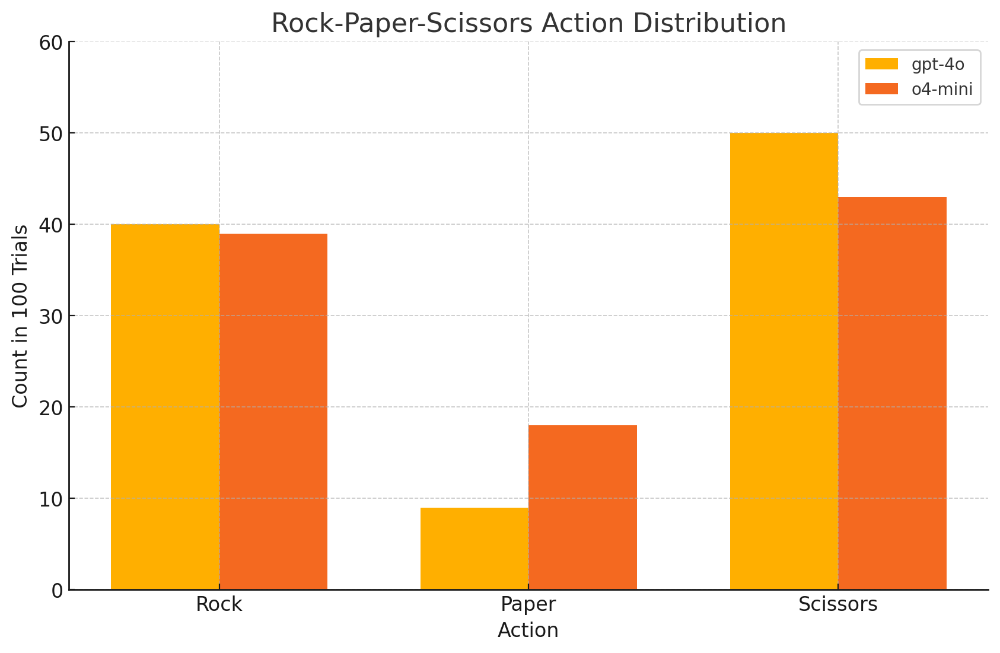

# Rock–Paper–Scissors Bias Experiment

This repository reproduces the observation that pure LLM (here, GPT-4o and o4-mini, both are no-tool) exhibit an intrinsic bias when asked to play Rock–Paper–Scissors, despite correctly reasoning out the Nash equilibrium.



## Experiment Overview

- **Models tested**: `gpt-4o`, `o4-mini`
- **Trials per model**: 100
- **Prompt**:  

```text
  You are playing the Rock-Paper-Scissors game.
  You should first reason about the Nash equilibrium of this game,
  and then choose one action from Rock, Paper, and Scissors based on your reasoning.
  Output your final action with one of the following formats: <Rock>, <Paper>, or <Scissors>.
  Be careful. You can use the <action> format only once for your final action.
````

* **Temperature**: 1.0 (For gpt-4o. As for o4-mini, we currently cannot determine the temperature.)
* **Extraction**: Regular expression to capture `<Rock>`, `<Paper>`, or `<Scissors>`.

## Results

| Model   | Rock | Paper | Scissors |
| ------- | ---- | ----- | -------- |
| gpt-4o  | 40%  | 9%    | 50%      |
| o4-mini | 39%  | 18%   | 43%      |

> **Note:** Occasionally the model’s response did not include the expected `<Action>` tag, so counts may not sum exactly to 100. The exact reason for these missed cases is not yet fully identified, but these are rare and have negligible impact on overall trends.

GPT-4o is known to favor “Rock”  — dubbed “Doraemon” bias by some people. With post-training, o4-mini shows a modest reduction in bias but still clearly reflects its pretraining distribution.

## Setup & Usage

1. **Clone & enter directory**

   ```bash
   git clone <repo-url>
   cd <repo>
   ```

2. **Create a virtual environment & install deps**

   ```bash
   python3 -m venv venv
   source venv/bin/activate
   pip install -r requirements.txt
   ```

3. **Create .env file and set your API key**

   ```bash
   OPENAI_API_KEY=sk-...
   ```

4. **Run the experiment**

   ```bash
   python main.py
   ```

5. **View results**
   * Check the console for per-action counts and percentages.

---

Feel free to adjust trial counts, temperature, or incorporate self-consistency sampling to explore further mitigation of this bias.
